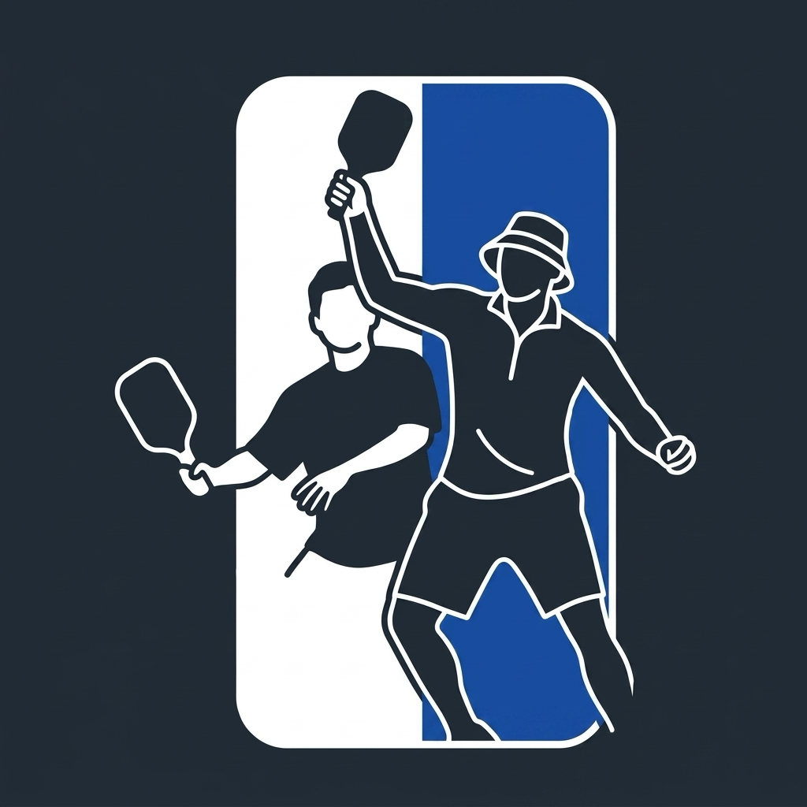

# NLP - NEEP Score Tracker 🏓

  

A modern, real-time tournament scoring system built for Major League Pickleball (MLP) team formats.

## Features
- **Snake Draft**: Real-time team drafting with support for uneven rosters and sit-out rotations.
- **Dynamic Match Dashboard**: Regulation games (Men's Doubles, Women's Doubles, Mixed Doubles 1 & 2), randomized extra games, and Dreambreakers.
- **Live Cloud Sync**: Powered by Google Firebase Firestore with zero-latency live updates across player phones.
- **Spectator & Admin Modes**: Secure admin controls via PIN with read-only spectator views for players and fans.
- **All-Time Leaderboards**: Live standings, team points, match differential, and partnership analytics.